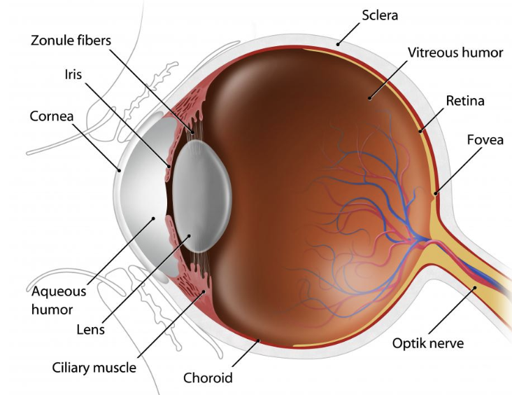

# Retinal-Image-Analysis

Fundus images are the images of the interior surface of the eye opposite the lens and includes retina, optic disc etc. Diabetic retinopathy is a diabetes complication that affects eyes and caused by damage to the blood vessels of the light-sensitive tissue at the back of the eye (retina). It can be detected with the help of fundus images.

<!--  -->

Ravi kamble.

